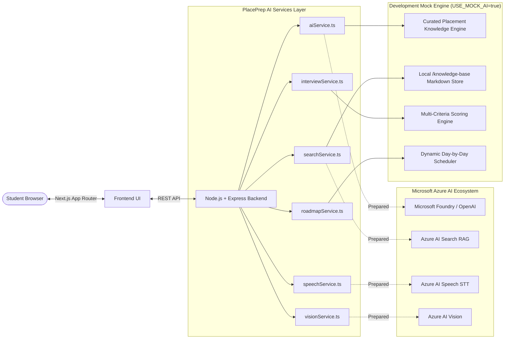

# PLACEPREP

> **Prepare Smarter. Interview Better. Get Placement Ready.**

An AI-powered Campus Placement Preparation Assistant engineered for college students to accelerate their technical interview readiness through grounded generative AI, realistic voice and vision mock interview simulation, and personalized multi-week curriculum planning.

---

## 1. Problem Statement

College students preparing for technical campus placement drives face significant hurdles:
- **Disorganized Preparation**: Students struggle to balance Data Structures & Algorithms (DSA), System Design, Object-Oriented Programming (OOP), and DBMS concepts within tight hiring timelines.
- **Lack of Realistic Interview Practice**: Most practice tools are purely text-based and fail to replicate the pressure and structure of live video and voice technical rounds.
- **Unverified AI Doubts Resolution**: Generic AI chatbots often hallucinate code complexities or produce generic advice detached from actual campus recruitment patterns.

**PlacePrep** addresses these challenges directly by providing a focused, production-grade AI platform built specifically around campus hiring workflows.

---

## 2. Three Core AI Features

PlacePrep deliberately focuses on **EXACTLY THREE** high-impact AI capabilities accessible directly from the student dashboard:

1. **AI Placement Chatbot (`/chat`)**:
   - Grounded in curated placement resources (DSA, DBMS, OOP, OS, SQL) via Retrieval-Augmented Generation (RAG).
   - Returns verified code explanations, time/space complexity analyses, and explicit source citations.
   - Includes conversational memory, quick prompt chips, and copy actions.

2. **AI Mock Interview (`/interview`, `/interview/session`, `/interview/result`)**:
   - Simulates live technical and HR interviews with candidate video streaming and real-time speech transcription (Speech-to-Text).
   - Captures defensible visual interaction signals (candidate camera presence and framing) while strictly adhering to ethical AI principles.
   - Evaluates student responses across multi-criteria rubrics: **Technical Knowledge**, **Answer Relevance**, and **Communication**, generating comprehensive question-by-question reviews.

3. **Personalized Placement Roadmap Generator (`/roadmap`, `/roadmap/view`)**:
   - Synthesizes tailored preparation timelines (30, 45, 60, or 90 days) based on target role, skill baseline, daily study hours, and chosen subjects.
   - Provides an interactive week-by-week and day-by-day task checklist with dynamic progress calculation and direct links to relevant study notes.

---

## 3. Technology Stack

- **Frontend**:
  - Framework: [Next.js 14](https://nextjs.org/) (App Router, React 18, TypeScript)
  - Styling: [Tailwind CSS](https://tailwindcss.com/) (Custom deep midnight navy `#07111F` / `#0B1220` design system)
  - Icons: [Lucide React](https://lucide.dev/)
  - Media & Audio: WebRTC MediaDevices API & HTML5 Web Speech API
- **Backend**:
  - Runtime: [Node.js](https://nodejs.org/) with [Express](https://expressjs.com/) (TypeScript, ES Modules)
  - Validation: Strict request schemas and centralized operational error handling
- **Cloud & AI Prepared Integrations**:
  - Microsoft Foundry / Azure OpenAI Service (`gpt-4o` deployment)
  - Azure AI Search (Knowledge Grounding / RAG)
  - Azure AI Speech (Streaming Speech-to-Text)
  - Azure AI Vision (Defensible presence and framing signals)
  - Microsoft Entra ID (Student Single Sign-On readiness)

---

## 4. System Architecture



---

## 5. Development Mock Mode

To enable instant evaluation, testing, and grading without requiring live Microsoft Azure subscription keys, PlacePrep features a built-in **Development Mock Mode** controlled by:

```env
USE_MOCK_AI=true
```

When Mock Mode is enabled:
- **Chatbot**: Returns rich, grounded placement solutions with code blocks, Big-O analysis, and source citations based on `/knowledge-base`.
- **Interview Voice & Vision**: Utilizes the browser's native Web Speech API and WebRTC camera stream for live testing, backed by realistic candidate response simulators and safe interaction presence checks.
- **Interview Evaluation**: Calculates realistic rubric scores (e.g., Overall 78%, Technical 82%, Relevance 85%, Communication 74%), itemizes strengths/improvements, and provides question-by-question feedback.
- **Roadmap Planner**: Generates structured, day-by-day task schedules tailored to student preferences.

When valid Azure credentials are provided and `USE_MOCK_AI=false`, the services connect directly to Azure AI endpoints without frontend changes.

---

## 6. Getting Started

### Prerequisites
- Node.js 18.x or 20.x+
- npm 9.x+

### 1. Clone & Setup Environment Variables
```bash
cp .env.example .env
```

### 2. Backend Setup
```bash
cd backend
npm install
npm run dev
```
The backend API server will start at `http://localhost:5000`. Verify health at `http://localhost:5000/api/health`.

### 3. Frontend Setup
In a separate terminal:
```bash
cd frontend
npm install
npm run dev
```
The Next.js application will start at `http://localhost:3000`.

---

## 7. API Documentation

| Method | Endpoint | Description | Sample Request | Sample Response |
|---|---|---|---|---|
| `POST` | `/api/chat` | AI Chatbot query with RAG | `{"message": "Explain binary search"}` | `{"answer": "...", "sources": ["DSA Fundamentals"]}` |
| `POST` | `/api/interview/start` | Initialize mock interview session | `{"role": "Software Developer", "difficulty": "Intermediate", "type": "Technical", "questions": 5}` | `{"sessionId": "...", "question": "..."}` |
| `POST` | `/api/interview/answer` | Submit student answer | `{"sessionId": "...", "questionId": "...", "transcript": "..."}` | `{"score": 84, "feedback": "...", "nextQuestion": {...}}` |
| `POST` | `/api/interview/finish` | Conclude interview & generate report | `{"sessionId": "..."}` | `{"overallScore": 78, "technical": 82, "strengths": [...], "improvements": [...]}` |
| `POST` | `/api/roadmap/generate` | Generate personalized preparation plan | `{"role": "Software Developer", "level": "Beginner", "dailyHours": 2, "duration": 60, "topics": ["DSA", "OOP"]}` | `{"duration": 60, "weeks": [...]}` |
| `GET` | `/api/health` | Service health & AI mode status | None | `{"status": "healthy", "mode": "Development Mock Mode"}` |

---

## 8. Responsible AI Considerations

PlacePrep adheres to strict responsible and ethical AI guidelines:
1. **No Emotion or Biometric Profiling**: Visual analysis is limited to operational signals (e.g. camera stream active, candidate centered in frame). PlacePrep **explicitly does NOT** infer emotion, honesty, confidence, personality, or mental state from facial appearance.
2. **AI Transparency**: Disclaimers are clearly visible across the application noting that all interview scores and roadmap tasks are AI-generated practice estimates.
3. **Knowledge Grounding**: The chatbot grounds answers in curated placement references to prevent hallucinations and maintain curriculum relevance.

---

## 9. Testing & Verification

- **Backend TypeScript Compilation**:
  ```bash
  cd backend && npm run build
  ```
- **Frontend Production Build**:
  ```bash
  cd frontend && npm run build
  ```

---

## 10. Deployment (Vercel)

PlacePrep is deployed using Vercel with separate frontend and backend services.

### 🌐 Live Application

**[Open PlacePrep]https://place-prep-frontend-kappa.vercel.app/**

### Deployment Services

| Component | Technology | Deployment |
|---|---|---|
| Frontend | Next.js / React | Vercel |
| Backend API | Node.js / Express | Vercel |
| Database | Supabase PostgreSQL | Supabase |
| AI Services | Microsoft Foundry / Azure AI | Microsoft Azure |
| Knowledge Search | Azure AI Search | Microsoft Azure |

### Backend API

The backend API is deployed separately at:

**https://place-prep-ai-tau.vercel.app**

The frontend communicates with the deployed backend API for authentication, chatbot, mock interview, roadmap generation, and other application services.

### Deployment Guide

See the complete step-by-step guide:

[**docs/vercel-deployment.md**](https://github.com/nitika0109-cu/PlacePrep-AI/blob/main/docs/vercel-deployment.md)

---

## 11. Future Improvements

- Institutional admin dashboard for college placement officers to view aggregate readiness trends across student cohorts.
- Native Microsoft Entra ID (Azure AD) campus login integration.
- Voice-activated text-to-speech (TTS) audio narration for the AI interviewer using Azure Neural Voices.

---

## 11. Team Contribution

Developed as an Academic AI Capstone Project demonstrating Microsoft Azure AI architectures (Microsoft Foundry, Azure AI Search, Azure AI Speech, Azure AI Vision, and RAG).
